layout: true
  
<div class="my-footer"><span>Qiao-Guo Tan/CEE/XMU | tanqg@xmu.edu.cn | 2025-Apr-17   
&emsp;&emsp;&emsp;&emsp;&emsp;&emsp;&emsp;&emsp;&emsp;&emsp;&emsp;&emsp;&emsp;
&emsp;&emsp;&emsp;&emsp;&emsp;&emsp;&emsp;&emsp;&emsp;&emsp;&emsp;&emsp;&emsp;
</span></div> 


---

class: inverse

### *Statistics starts with a problem, proceeds with the collection of data, continues with the data analysis and finishes with conclusions.*  

### 统计学始于问题，进于数据收集与分析，终于结论。

--

### *It is a common mistake of inexperienced statisticians to plunge into a complex analysis without paying attention to the objectives or even whether the data are appropriate for the proposed analysis.*  
### 缺乏经验的人常犯这样的错误：不清楚目的，不管数据和分析方法是否相适，就直接一头扎进去，做复杂的统计分析。 

-- Faraway, Julian James. 2015. Linear models with R. 2nd ed. CRC Press.

???
As Einstein said, the formulation of a problem is often more essential than its solution
which may be merely a matter of mathematical or experimental skill.


---
class: inverse

<br>
<br>
### *A main goal in science is the understanding of the relationship among important variables. The relationship, either described qualitatively or quantitatively, is a model.*  

### 科学的主要目的之一是理解重要变量之间的关系。对关系的描述就是模型，关系可以是定性的也可以是定量的。
<br>

-- Qian S. 2017. Environmental and Ecological Statistics with R. 2nd ed. CRC Press.


???

模型的两个目的：归因、预测  
In general, a model is developed with one of the two general objectives causal inference and prediction.
---

## 线性模型  

- .large[假设我们需要模拟**响应变量**（*Y*）和3个**预测变量**（*X*<sub>1</sub>，*X*<sub>2</sub>，*X*<sub>3</sub>）之间的关系，可以写成以下通式：]  

$$Y = f (X_1,X_2,X_3) + ε$$
--

- .large[然而，*f*到底是什么函数，基于数据通常难以确知。我们可以用一个简单的线性模型进行模拟（问题因此简化为参数β<sub>i</sub>值的估算）：]
 
$$Y = β_0 + β_1X_1 + β_2X_2 + β_3X_3 + ε$$
--

- .large[需注意，在线性模型中参数是线性形式的，但变量不一定是线性的，例如以下也是线性模型：]


$$Y = β_0 + β_1X_1 + β_2logX_2 + β_3X_1X_2 + ε$$

--

- .large[而以下模型就不是线性模型：] 
$$Y = β_0 + β_1X_1^{β_2} + ε$$

---

## 关于线性模型的常见误解

- .large[线性模型看上去很简单，只能处理简单的数据？不是，线性模型可以处理非常复杂的数据。]

<br>
--

- .large[线性模型描述的关系一定是直线？不是，线性模型也可以描述曲线关系。]

<br>

--
- .large[此外，需注意：非线性模型通常来自对**理论**、**机理**的理解，而非**经验**研究。]


---

## 线性回归（Linear Regression） 

.large[线性模型描述一个**响应变量** *Y*与一个或多个**预测变量** *X*之间的关系。]  

--

- .large[响应变量：也称为输出变量、因变量]  

--

- .large[响应变量需为连续变量]  

--

- .large[预测变量：也称为输入变量、自变量、解释变量]  

--

- .large[预测变量可以是连续变量、离散变量、分类变量]  

--

<br>
<br>  

.large[**简单线性回归**（simple linear regression）：仅有一个预测变量]   

--
.large[**多元线性回归**（multiple linear regression）： 有多个预测变量]  

---

class: inverse, center, middle  

##  简单线性回归  

---

## 需要用到的程序包  

```{r message=FALSE}
library(tidyverse)
library(QuantPsyc) 
library(relaimpo) 

```

--
## 数据 

数据下载：https://pan.baidu.com/s/1z93sG8AfkPdKi4UClXjOtQ?pwd=y281  
数据来源：Qian S. 2017. Environmental and Ecological Statistics with R. 2nd ed. CRC Press. Chapter 5 Linear Models.


---

## 了解数据  

.pull-left[

```{r}
d0 <- read.csv("laketrout.csv")

anyNA(d0) # 检查是否存在NA
sum(is.na(d0)) # 统计NA的总数量
colSums(is.na(d0)) #按列统计NA的数量

```

]


.pull-right[

```{r}

d0[!complete.cases(d0), ] #显示包含NA的行
```

]


---

## 了解数据  

```{r}
d <- na.omit(d0) #length存在缺失值，为便于分析，去除缺失值
head(d)
str(d)
```


---

## 背景知识  

- 突吻红点鲑（lake trout，*Salvelinus namaycush*）：分布于北美，生长缓慢，所吃食物随自身尺寸增长而改变<sup>[[1]](https://en.wikipedia.org/wiki/Lake_trout)</sup>
- 美国1979年禁止生产PCB<sup>[[2]](https://archive.epa.gov/epa/aboutepa/epa-bans-pcb-manufacture-phases-out-uses.html)</sup>


.pull-left[

```{r echo=F, out.width=1200/2.4, out.height=800/2.4}


```
]

--

.pull-right[

```{r echo=F, out.width=827/1.66, out.height=548/1.66}
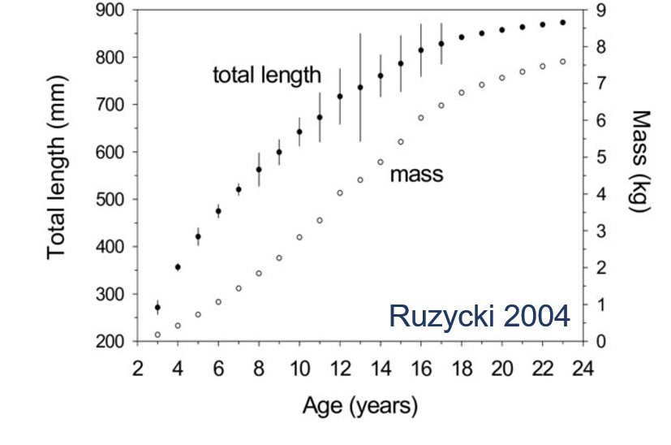
```

]


---

## 提出问题  

- .large2[鱼体内PCB浓度是否有时间趋势？]  

--

- .large2[鱼体内PCB浓度是否受鱼尺寸的影响？]  

---

## 作图了解数据：PCB vs. 年份，PCB vs. 鱼体长  

```{r warning=FALSE, message=FALSE}
library(tidyverse)
```

.pull-left[

```r
ggplot(d, aes(year, pcb))+
  geom_point()
```

```{r echo=F, out.width=360*1.2, out.height=270*1.2}
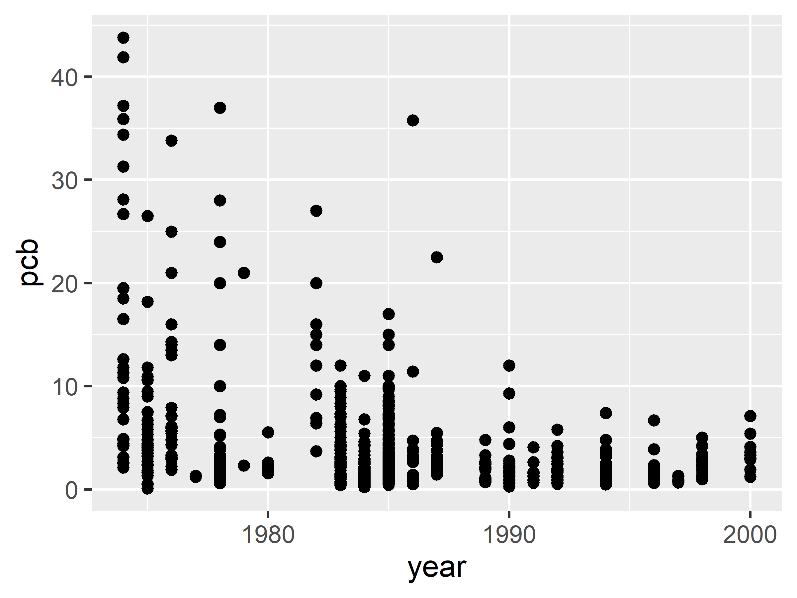

```
]


.pull-right[

```r
ggplot(d, aes(length, pcb))+
  geom_point()
```

```{r echo=F, out.width=360*1.2, out.height=270*1.2}
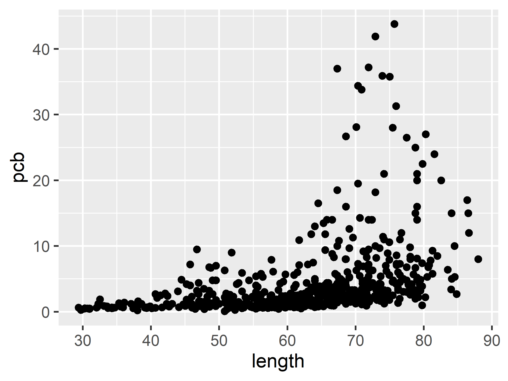
```
]


---
## 作图了解数据：PCB浓度采用对数坐标

- 污染物浓度通常呈对数正态分布  
- 从图上也可得知，PCB浓度在对数坐标下分布更均匀  

.pull-left[

```r
ggplot(d, aes(year, pcb))+
  geom_point()+
  scale_y_log10()
```

```{r echo=F, out.width=360*1.2, out.height=270*1.2}
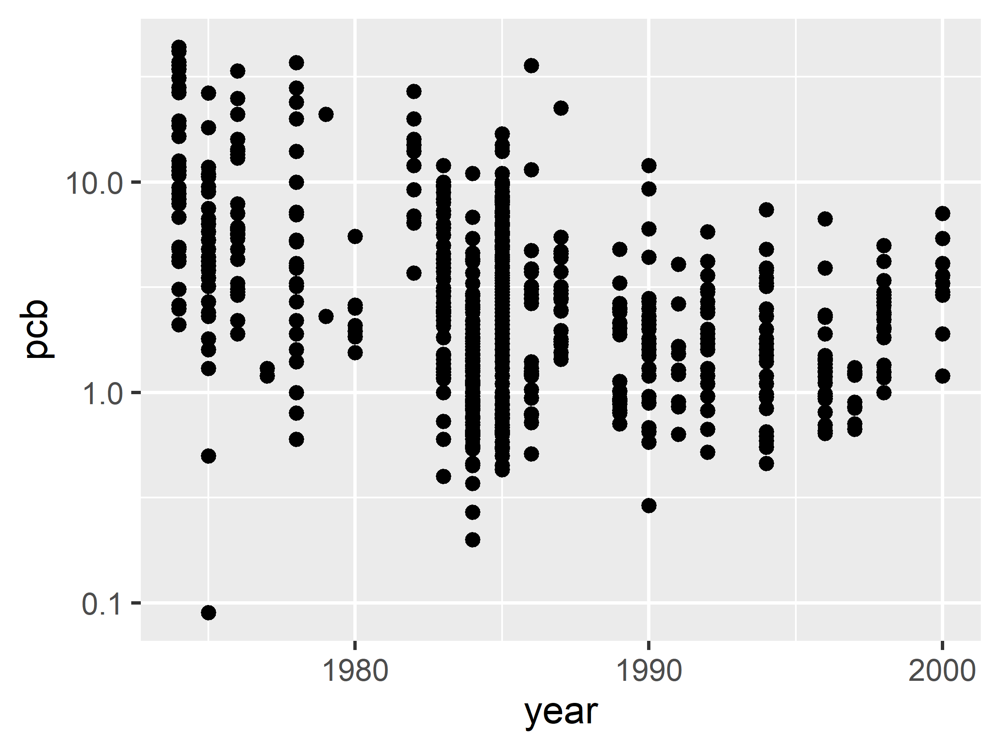
```
  
]

.pull-right[

```r
ggplot(d, aes(length, pcb))+
  geom_point()+
  scale_y_log10()
```  
  
```{r echo=F, out.width=360*1.2, out.height=270*1.2}
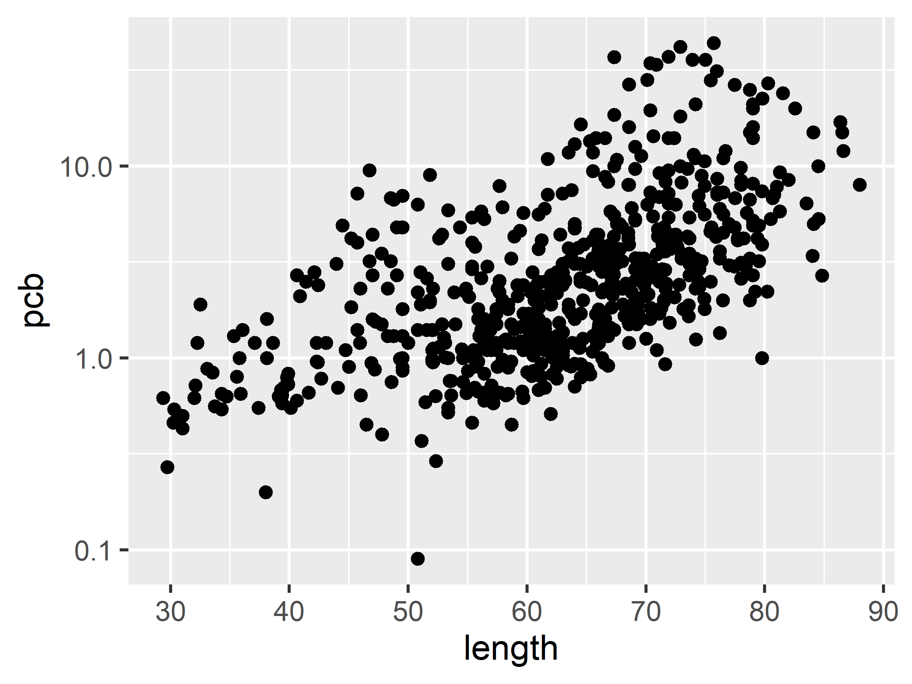
```
  
]

---

## 数据转化：PCB浓度取自然对数  

- .large[根据以上的观察，将PCB浓度取对数后用于数据分析]  

```{r}
d$ln_pcb <- log(d$pcb)  #增加ln_pcb数据列，为pcb的自然对数（也可取10为底的对数）
head(d) 
```

---

### 年份对PCB浓度的影响 - `lm()`分析结果的解读   

.pull-left67[
```{r, highlight.output=c(12, 17, 18)}
mod.1 <- lm(ln_pcb ~ year, data=d) #格式：响应变量 ~ 预测变量
summary(mod.1) #用summary()查看线性回归的结果
```
]

--

.pull-right67[

**结果解读：**

- 年份变量对ln_pcb有显著影响<br>（*p* < 2e-16  ）  

- *R*<sup>2</sup>=0.1469，表明年份变量可以解释14.69%的ln_pcb变异

- 该模型对ln_pcb的预测显著优于空模型（null model：ln_pcb ~ 1，即平均值）（*F*<sub>1, 630</sub> = 106.5，*p* < 2.2e-16）
]

---

### 年份对PCB浓度的影响 - 参数的解读   


<center> .large[`ln_pcb = 117 - 0.0583 * year`] </center>   
.large[

- **斜率-0.0583**   
  * ln_pcb值每年减少0.0583，即PCB浓度每年降低约6%（*y* = *y*<sub>0·</sub>e<sup>-0.0583·year</sup>，一级动力学）


- **截距117**  
  * year = 0时（公元0年——无实际意义），ln_pcb的值为117    
  * year数据需转化，使模型参数更具实际意义，更容易解读  


- **不确定度** `Residual standard error: 0.8916`  
  * 举例理解：1974年ln_PCB值的符合正态分布N(116.615681 - 0.058279 × 1974; 0.89)，即N(1.57, 0.89)。

]

???
When putting the two parts together, the fitted model can be seen as a
conditional normal distribution describing the probability distribution of log
PCB concentrations.   可根据公式计算出某年ln_PCB的平均值（或预期值） 

The mean of the log PCB distribution is the deterministic part of the model, and the standard deviation is the same as the standard deviation of the residuals (the random part). 

---

### 数据转化：设置起始年份  

.pull-left67[
```{r}
d$yr <- d$year - 1974  #以1974年为起始年
mod.2 <- lm(ln_pcb ~ yr, data=d)
summary(mod.2)
```
]

.pull-right67[
**结果解读：** 

- 斜率不变,ln_pcb值每年减少0.0583  

- 截距变为1.57，其含义是1974年ln_pcb的值为1.57，即PCB浓度是4.81 mg/kg（e<sup>1.57</sup>=4.81 mg/kg）  

]


---

### 体长对PCB浓度的影响  

.pull-left67[
```{r highlight.output=c(11, 12)}
mod.3 <- lm(ln_pcb ~ length, data=d)
summary(mod.3)
```
]

.pull-right67[

**结果解读：**  
- 体长对ln_pcb有显著影响  

- 体长每增加1 cm，ln_pcb值增加0.0490   

- 截距为- 2.16，其含义是当鱼体长为0时（没有意义），ln_pcb = - 2.16  

- *R*<sup>2</sup>=0.3564，表明体长可以解释35.64%的ln_pcb变异  

]


---

### 数据转化：尺寸中心化  

.pull-left67[
```{r}
mean_length <- mean(d$length) 
d$len_c <- d$length - mean_length  #各体长值减去平均体长，得到中心化的体长值  
mod.4 <- lm(ln_pcb ~ len_c, data=d)

summary(mod.4)

```
]

.pull-right67[

**结果解读：**   

- 斜率不变，体长每增加1 cm，ln_pcb值增加0.0490  

- 截距变为0.905，其含义是当鱼体长为平均值时，ln_pcb = 0.905 （即PCB浓度为2.47 mg/kg）  
]


---


class: inverse, center, middle  

##  多元线性回归  

---

## 多元线性回归  

.pull-left67[
```{r highlight.output=c(11,12,13,19)}
mod.5 <- lm(ln_pcb ~ yr + len_c, data=d)
summary(mod.5)
```
]

.pull-right67[

**结果解读：** 

- 年份有显著影响，若控制鱼体长不变，ln_pcb每年降低0.0849  

- 体长有显著影响，若控制年份不变，体长每增加1 cm，ln_pcb增加0.0599  

- 截距为1.88，含义是1974年体长等于平均体长的鱼体内PCB浓度是e<sup>1.88</sup>（即6.55）mg/kg

- *R*<sup>2</sup>=0.6501，表明年份和体长一起可以解释65.01%的ln_pcb变异  

]

---

## 交互作用（Interaction）  

.large[
**`ln_pcb ~ yr + len_c`**  

**以上模型暗含假设：**  

- 年份和鱼体长独立影响ln_pcb  
- 年份的影响（即年份的斜率）不受鱼体长的影响
- 鱼体长的影响（即体长的斜率）在各个年份均相同 ]  
--
.large[
**实际上：**    

- 较大的鱼类倾向于摄食PCB浓度较高的饵料，其体内PCB随时间减少的速度应慢于小鱼  
- 1970年代末禁用PCB，环境中PCB浓度应当逐年降低，PCB浓度与鱼体长之间的关系应当随时间而变化
- 年份和体长在影响ln_pcb时有交互作用  
]
---

## 包含交互作用的多元线性回归    

```{r}
mod.6 <- lm(ln_pcb ~ yr * len_c, data=d)
```

等价于：
```r
mod.6 <- lm(ln_pcb ~ yr + len_c + yr:len_c, data=d) # “yr:len_c”即“yr*len_c”
```

---

## 包含交互作用的多元线性回归  

.pull-left67[
```{r highlight.output=c(14)}
summary(mod.6)
```
]

.pull-right67[

**结果解读：** 

- 年份和鱼体长在影响ln_pcb时有显著的交互作用（*p* = 0.035）  

]

---

## 包含交互作用的多元线性回归：结果解读

**`ln_pcb = 1.88 − 0.086 * yr + 0.053 * len_c + 0.00072 * yr * len_c + ε`**

整理可得：  

**`ln_pcb = 1.88 - (0.086 - 0.00072 * len_c) * yr + 0.053 * len_c + ε`**
 
### 举例：  
- 平均尺寸 len_c = 0（体长62.61 cm）, `ln_pcb = 1.88 - 0.085 * yr +  ε`   
- 大鱼 len_c = 10（体长72.61 cm）,    `ln_pcb = 2.41 - 0.078 * yr +  ε`    

### 解读：  
- ln_pcb与年份、体长之间的斜率不再是常数  
- 大鱼的ln_pcb高  
- 而且大鱼的ln_pcb随年份增加降低得慢  

---

## 包含交互作用的多元线性回归：结果解读  

**`ln_pcb = 1.88 − 0.086 * yr + 0.053 * len_c + 0.00072 * yr * len_c + ε`**

换一种方式整理可得：   

**`ln_pcb = 1.88 + (0.053 + 0.00072 * yr) * len_c − 0.086 * yr + ε`**

### 举例：  
- yr = 0 （即1974年）, `ln_pcb = 1.88 + 0.053 * len_c +  ε`  
- yr = 10（即1984年）, `ln_pcb = 1.02 + 0.060 * len_c + ε` 


### 解读：  
- 年份确定，则ln_pcb与体长关系仍是线性的  
- ln_pcb随体长增加的趋势（即斜率）逐年增强  


---
class: inverse, center, middle  

## 提取线性回归结果中的信息  


---

### 如何提取模型中包含的信息？ 


**查看mod.6包含了哪些信息**   

```{r}
names(mod.6)
     
```


**参数值**
```{r}
mod.6$coefficients

```
---

### 如何提取模型中包含的信息？ 

**预测值**  
```{r}
mod.6$fitted.values[1:10] # 为节省空间，只显示前10个预测值
```

**残差** 
```{r}  
mod.6$residuals[1:10]  #显示前10个残差

```


---

### 如何提取模型中包含的信息？

**查看summary(mod.6)包含了哪些信息**  

```{r}
names(summary(mod.6))

```

有一些信息与**`mod.6`**中所含内容重复  

.pull-left37[
**提取*R*<sup>2</sup>和*R*<sup>2</sup><sub>adj</adj> ** 

```{r}
summary(mod.6)$r.squared
summary(mod.6)$adj.r.squared
```
]


.pull-right37[

** 带显著性检验结果的参数值 **  
```{r}
round(summary(mod.6)$coefficients, 5) #为节省空间，显示5位小数
```
]

---

### 模型参数的95%置信区间  


```{r message=F}

confint(mod.6)

```

---
class: inverse, middle, center 

## 多元线性回归中<br>各解释变量的相对贡献  

---

### 方法1：根据标准化的斜率（即*b*值或β值）判断  

```{r message=F, warning=F}
library(QuantPsyc) # lm.beta函数在此程序包里
lm.beta(mod.6) #此处以mod.6为例
```
**结果解读：**  
- 年份（yr）每增加一个标准差，响应变量（ln_pcb）减少0.564个标准差  

- 体长（len_c）每增加一个标准差，响应变量（ln_pcb）增加0.642个标准差  

- 体长与年份之积（yr*len_c）每增加一个标准差，响应变量（ln_pcb）增加0.005个标准差 

**综上：** 在该模型中，体长对于解释鱼体内PCB浓度有更大的贡献。


???
https://blog.minitab.com/blog/adventures-in-statistics-2/how-to-identify-the-most-important-predictor-variables-in-regression-models

http://cran.nexr.com/web/packages/QuantPsyc/index.html

---

### 方法2：将*R*<sup>2</sup>分解到各个解释变量    

.pull-left57[
```{r message=F, warning=F}
library(relaimpo) 
calc.relimp(mod.6)

```
]

.pull-right57[
**结果解读：**  
- 该模型可解释响应变量（ln_pcb）65.26%的变异  
- 年份（yr）贡献了其中的22.03%
- 体长（len_c）贡献了其中的42.98%  
- 体长与年份之积（yr*len_c）贡献了0.25%

计算各解释变量的贡献是一个复杂的问题，当解释变量之间存在相关性时，这个问题本身就难以清楚定义，以上只是提供了大致客观有用的度量。  

**更多信息请参考**：http://prof.beuth-hochschule.de/groemping/software/relaimpo/  
]


???

Johnson, J. W. (2000). A heuristic method for estimating the relative weight of predictor variables in multiple regression. Multivariate Behavioral Research, 35(1), 1-19.
https://www.tandfonline.com/doi/abs/10.1207/S15327906MBR3501_1
The relative weight of predictor variables in multiple regression is difficult to determine because of non-zero predictor intercorrelations. Relative weight (also called relative importance by some researchers) is defined here as the proportionate contribution each predictor makes to R2, considering both its unique contribution and its contribution when combined with other variables. Although there are no unambiguous measures of relative weight when variables are correlated, some measures have been shown to provide meaningful results (Budescu, 1993; Lindeman, Merenda, & Gold, 1980). These measures are very difficult to implement, however, when the number of predictors is greater than about five. A method is proposed that is computationally efficient with any number of predictors, and is shown to produce results that are very similar to those produced by more complex methods. Recommendations are made for when this procedure may be applied and in what situations it is not appropriate. 

 
---
class: inverse, middle, center  

## 模型的诊断  


---

## 线性模型的假设  

.large[
1. **线性** Linearity: The relationship between X and the mean of Y is linear.

1. **同方差性** Homoscedasticity: The variance of residual is the same for any value of X.

1. **独立性** Independence: Independence of residuals error terms. Observations are independent of each other.

1. **正态分布** Normality: The residuals are normally distributed. For any fixed value of X, Y is normally distributed.
]

???

Regression Model Diagnostics  

http://www.sthda.com/english/articles/39-regression-model-diagnostics/161-linear-regression-assumptions-and-diagnostics-in-r-essentials/

---

## 诊断：是否线性    

.pull-left[

```r
plot(mod.6, which=1)
```

```{r echo=F, out.width=438*1.1, out.height=377*1.1}
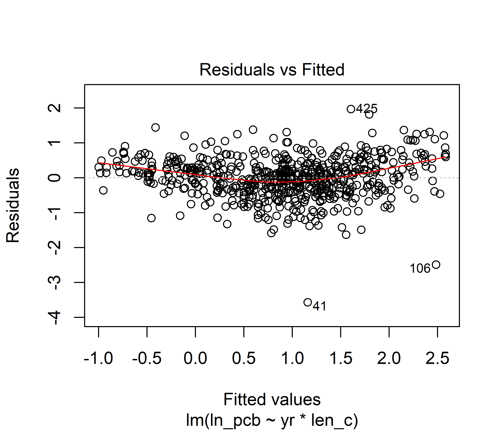
```
]  


.pull-right[

### 理想情况：
- 残差均匀分布在0上下  

- 残差趋势线（红线）接近0，且无明显趋势

### 解读：
- 残差略有非线性，表明存在当前模型未能解释的趋势

- 可以识别出数个异常点（行号标出）

]

???


Residuals are leftover of the outcome variable after fitting a model (predictors) to data and they could reveal unexplained patterns in the data by the fitted model.
---

## 诊断：是否正态分布    

.pull-left[
```r
plot(mod.6, which=2)
```


```{r echo=F, out.width=438*1.1, out.height=377*1.1}
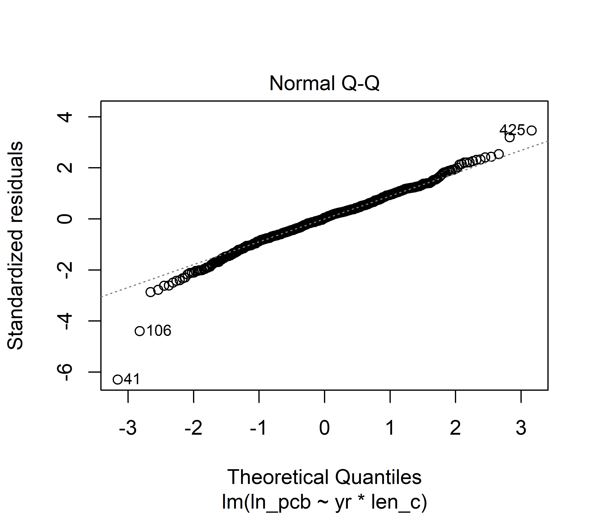
```
]

.pull-right[

### 理想情况：
- 点均落在QQ图对角线上，即残差呈正态分布    

### 解读：
- 图上残差大多落在对角线上，较符合正态分布

- 可以识别出数个异常点（行号标出）

]

---

## 诊断：是否同方差性（homoscedasticity） 

Scale-Location (Spread-Location)图
.pull-left[
```r
plot(mod.6, which=3)
```


```{r echo=F, out.width=438*1, out.height=377*1}
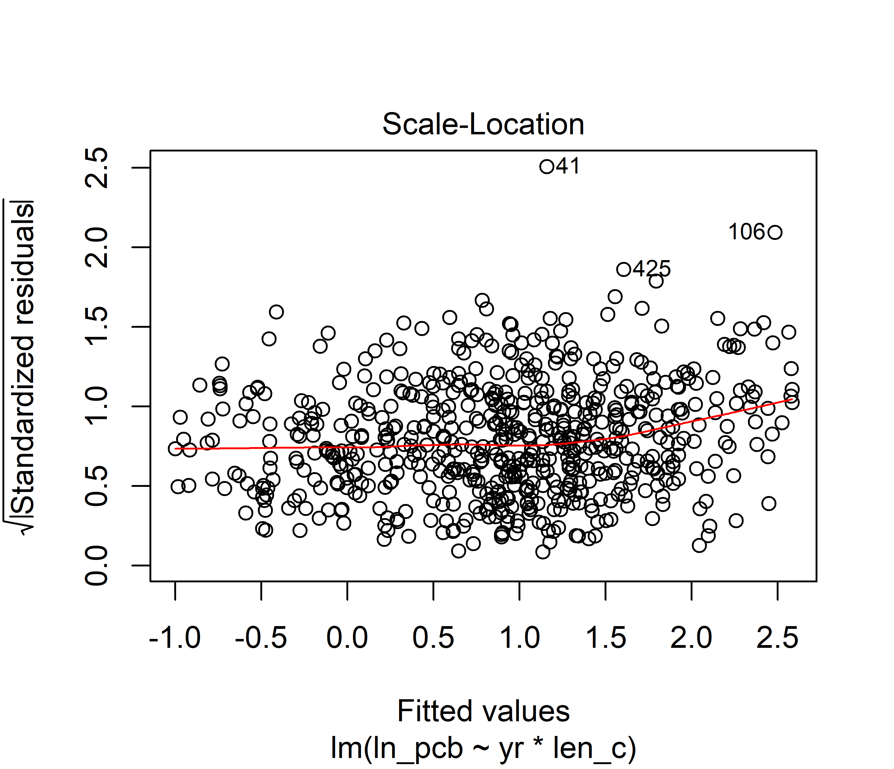
```
]

.pull-right[

### 理想情况：
- 标准化残差的平方根（y）的范围不随着模型预测值（x）明显变化，分散程度相等   
- 红线水平，无明显趋势

### 解读：
- 残差的标准差（SD）随模型预测值略有增大，存在异方差性  

]

???

同方差性 homoscedasticity
异方差性 heteroscedasticity
---

## 问题数据点    

.large[
**离群点**（outlier）: an observation that has a large residual   

**高杠杆点**（leverage point）: an observation that has a value of x that is far away from the mean of x 

**高影响点**（influential observations）: an observation that changes the slope of the line

]

???
如发现异常点，应检查是否有输入错误、测定错误等。如果错误，数据删除。
异常点可能会提示重要的信息，若排除错误，需要进一步研究。

---

## 诊断：高影响点（influential data point）的识别  


.pull-left[

```r
plot(mod.6, which=4)
```

```{r echo=F, out.width=438*1.1, out.height=377*1.1}
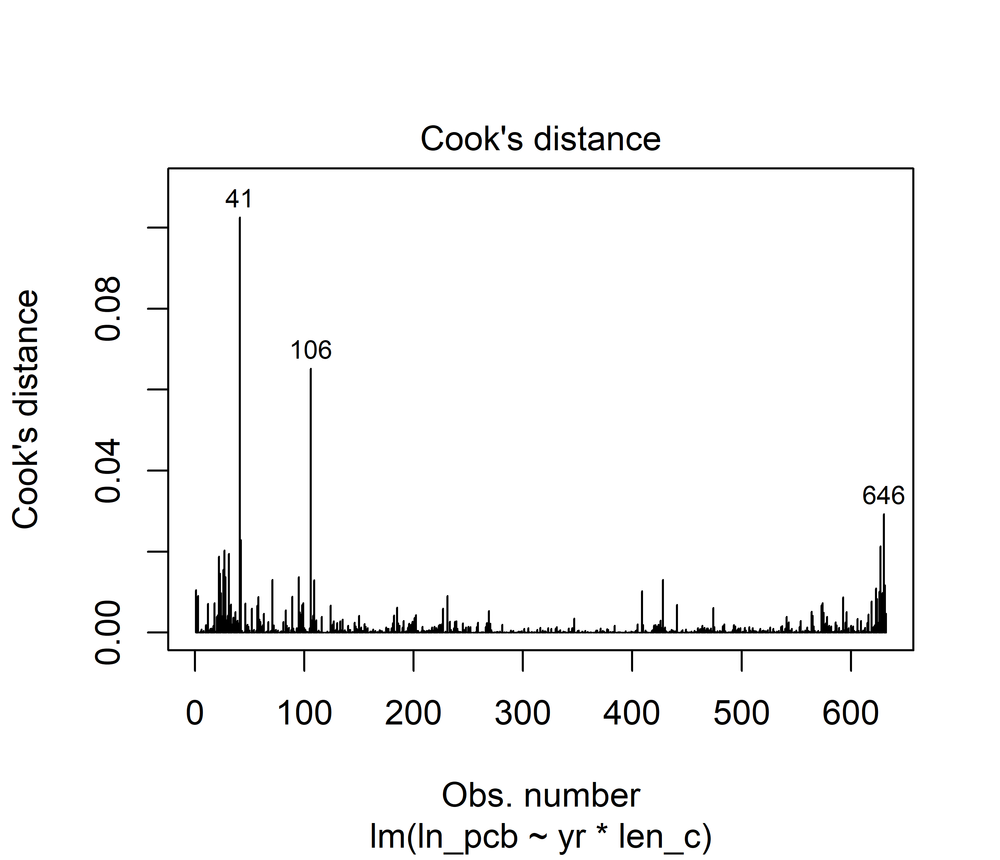
```
]

.pull-right[

- 高影响点：有无该点，模型参数值差别较大  

- 用Cook’s distance来度量某个点对回归结果的影响

- 当Cook’s distance远大于1时，则该点可能是高影响点，需检查该数据是否有误

- 图上显示Cook’s distance均小于1，说明无高影响点

]


---

## 诊断：高杠杆点（high leverage point）    


```r
plot(mod.6, which=5)

```
.pull-left[
```{r echo=F, out.width=438*1.1, out.height=377*1.1}
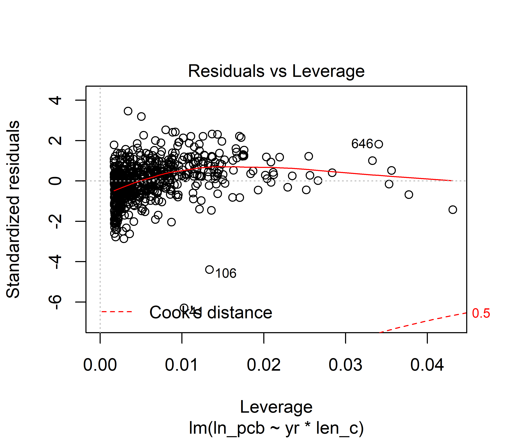
```
]

.pull-right[

- 高杠杆点：预测变量（x）值远高于其均值的点  

- 高杠杆 + 高残差 = 高影响

]

---

## 诊断：异常点识别

```r
plot(mod.6, which=6)
```


```{r echo=F, out.width=438*1.1, out.height=377*1.1}
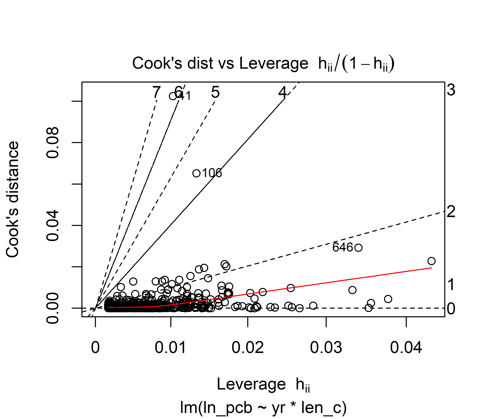
```


---

## 理解异常点、高杠杆点、高影响点  

.pull-left[
```{r, echo=F, eval=F, message=F}
library(cowplot)

set.seed(2)
x1 <- rnorm(10)
x2 <- rnorm(10)/5
y1 <- x1+x2

df0 <- data.frame(x=x1, y=y1)
df1 <- data.frame(x=c(x1, 0.5), y=c(y1, 1.7),label=c(rep("A",10),"B"))

p1 <- ggplot(df1, aes(x,y, color=label))+
  geom_point(size=2.5)+
  geom_smooth(method="lm", se=F, color="red2")+
  geom_smooth(data=df0,method="lm", aes(x,y), inherit.aes = F, 
              linetype="dashed", se=F, color="black")+
  scale_color_manual(values=c("black","red2"))+
  guides(color=F)+
  labs(title="Leverage: Low\nInfluence: Low")


df2 <- data.frame(x=c(x1, 0.7), y=c(y1, 8.7),label=c(rep("A",10),"B"))

p2 <- ggplot(df2, aes(x,y, color=label))+
  geom_point(size=2.5)+
  geom_smooth(method="lm", se=F, color="red2")+
  geom_smooth(data=df0,method="lm", aes(x,y), inherit.aes = F, 
              linetype="dashed", se=F, color="black")+
  scale_color_manual(values=c("black","red2"))+
  guides(color=F)+
  labs(title="Leverage: Low\nInfluence: High")


df3 <- data.frame(x=c(x1, 3), y=c(y1, 3.4),label=c(rep("A",10),"B"))

p3 <- ggplot(df3, aes(x,y, color=label))+
  geom_point(size=2.5)+
  geom_smooth(method="lm", se=F, color="red2")+
  geom_smooth(data=df0,method="lm", aes(x,y), inherit.aes = F, 
              linetype="dashed", se=F, color="black")+
  scale_color_manual(values=c("black","red2"))+
  guides(color=F)+
  labs(title="Leverage: High\nInfluence: Low")


df4 <- data.frame(x=c(x1, 3), y=c(y1, 0),label=c(rep("A",10),"B"))

p4 <- ggplot(df4, aes(x,y, color=label))+
  geom_point(size=2.5)+
  geom_smooth(method="lm", se=F, color="red2")+
  geom_smooth(data=df0,method="lm", aes(x,y), inherit.aes = F, 
              linetype="dashed", se=F, color="black")+
  scale_color_manual(values=c("black","red2"))+
  guides(color=F)+
  labs(title="Leverage: High\nInfluence: High")


plot_grid(p1,p2,p3,p4)

ggsave("lev_inf.png", width=532/90, height=454/90, dpi=600, unit="in")
```


```{r echo=F, out.width=532, out.height=454}
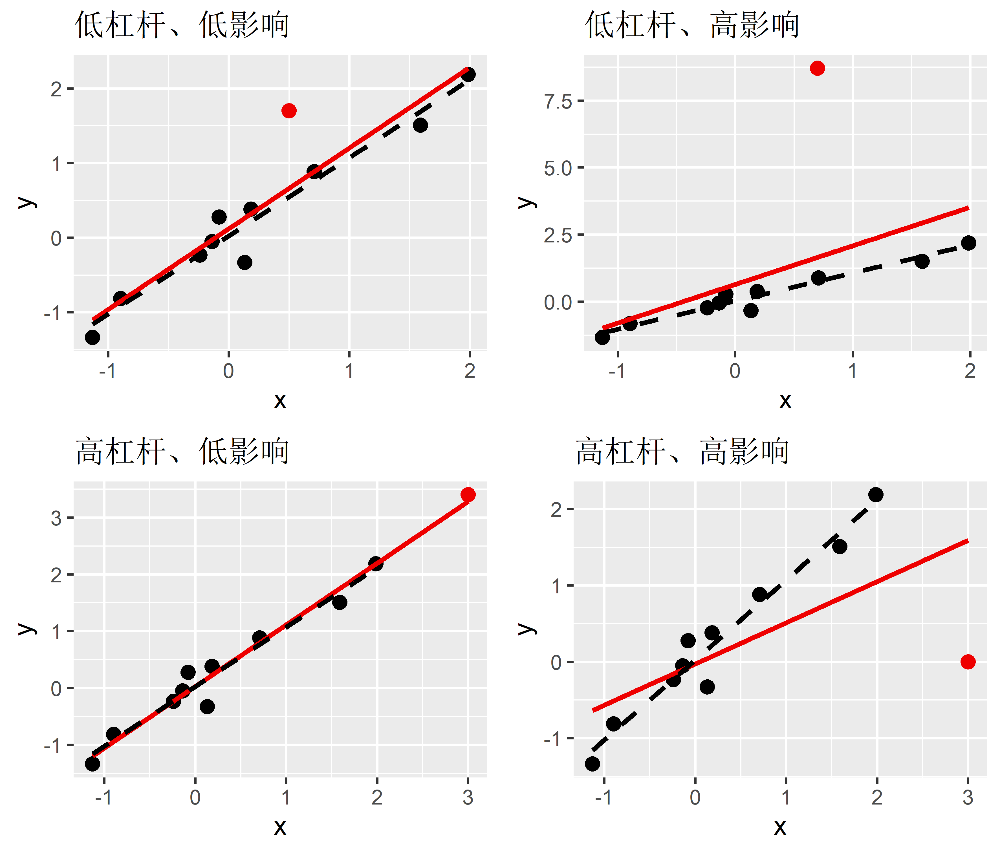
```

]


.pull-right[
```{r, echo=F, eval=F, message=F}
ggplot(d8, aes(x,y, color=label))+
  geom_point(size=2.5)+
  geom_smooth(method="lm", se=F, color="red2")+
  geom_smooth(data=d7,method="lm", aes(x,y), inherit.aes = F, 
              linetype="dashed", se=F, color="black")+
  scale_color_manual(values=c("black","red2"))+
  guides(color=F)+
  labs(title="高杠杆、高影响、低残差")

ggsave("lev_inf_cn_2.png", width=307/90, height=269/90, dpi=600, unit="in")
```


```{r, echo=F, out.width=307, out.height=269}
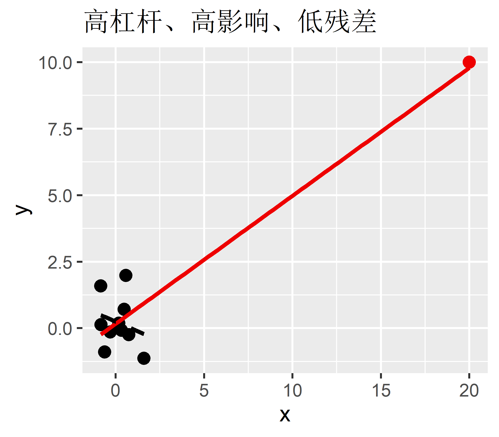
```

]


---

class: inverse, middle, center  

## 模型的改进

---

## 基于诊断结果改进模型  

.large[ - ln_pcb与鱼体长（len_c）之间的关系可能不是线性的]   

.large[ - 尝试往模型中加入len_c<sup>2</sup>项]  

```{r echo=F, eval=F, message=F}
ggplot(d, aes(len_c, ln_pcb))+
  geom_point()+
  geom_smooth()

```

```{r, echo=F, out.width=620, out.height=269}
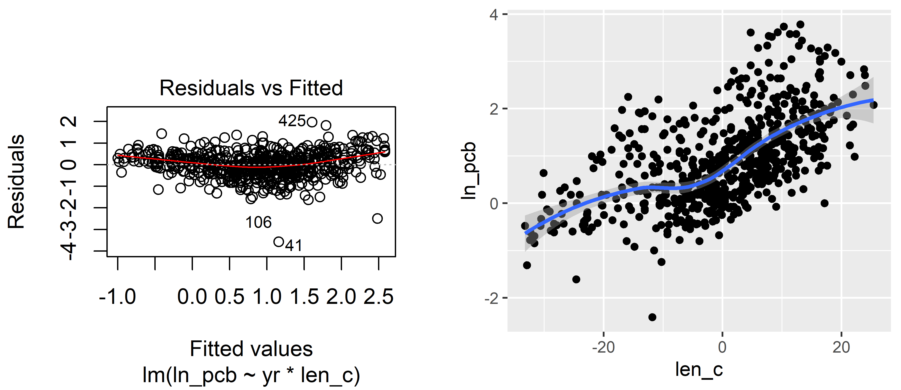
```


---

## 基于诊断结果改进模型 

.pull-left[
```{r highlight.output= 14}
mod.7 <- lm(ln_pcb ~ yr * len_c + I(len_c^2) , data=d)

summary(mod.7)
```
]

.pull-right[

###结果：

- len_c<sup>2</sup>项斜率的p值为2.61e-05，ln_pcb与len_c之间的关系非线性  

]

---

## 模型的改进 - 设置虚拟变量 （Dummy Variables）

.large[- `mod.6`显示年份与鱼体长存在交互作用]  


.large[- 一个可能的原因是：大鱼、小鱼不应该混在一起分析]  


.large[-  应该允许大鱼、小鱼有各自的截距和斜率]  

--

```{r}
d$size <- "small"
d$size[d$length>60] <- "large" #体长大于60为大鱼，否则为小鱼  

```

```r
mod.8 <- lm(ln_pcb ~ yr*size + len_c*size, data=d)
summary(mod.8)

```

### 等价于：  

```r
lm(ln_pcb ~ yr + len_c, data=subset(d, size=="small"))
lm(ln_pcb ~ yr + len_c, data=subset(d, size=="large"))
```

---

## 模型的改进 - 设置虚拟变量 （Dummy Variables）  

```{r echo=F}
mod.8 <- lm(ln_pcb ~ yr*size + len_c*size, data=d)
summary(mod.8)

```

---

## 模型的改进 - 设置虚拟变量 （Dummy Variables） 

所得结果将大鱼、小鱼的模型合二为一：

`ln_pcb = 1.75 - 0.0846 * yr - 0.132445sizesmall + 0.0776len_c + 0.003828 yr * sizesmall - 0.035479 * sizesmall * len_c`  


- 小鱼（sizesmall = 1）  
`ln_pcb = 1.62 -0.0807 * yr  + 0.0421 len_c`  

- 大鱼(sizesmall = 0)  
`ln_pcb = 1.75 - 0.0846 * yr   + 0.0776len_c`  

---

class: inverse, center, middle  

## 模型的比较  

---

## 模型比较 - ANOVA  

```{r}

anova(mod.6, mod.7)

```

- **解读**： mod.7相比mod.6显著改善了模型的解释能力（*p* < 0.001）


---

## 模型比较 - AIC和BIC 

.pull-left[
#### AIC：Akaike information criterion 

```{r}
AIC(mod.6)
AIC(mod.7)
```
#### mod.7的AIC小于mod.6，表明mod.7优于mod.6
]

.pull-right[
#### BIC：Bayesian information criterion

```{r}
BIC(mod.6)
BIC(mod.7)
```
#### mod.7的BIC小于mod.6，表明mod.7优于mod.6
]

???

How do I interpret the AIC
https://www.r-bloggers.com/how-do-i-interpret-the-aic/

---

class: inverse, center, middle  

## 附：基础概念  

---

## 基础概念  

.pull-left[
- Y的观测值：*y*<sub>1</sub>，*y*<sub>2</sub>，*y*<sub>3</sub>， ...，*y*<sub>*n*</sub>  
<br>

- Y的模型预测值：*f*<sub>1</sub>，*f*<sub>2</sub>，*f*<sub>3</sub>，...，*f*<sub>*n*</sub>  
<br>

- 残差：ε<sub>i</sub> = *y*<sub>i</sub> − *f*<sub>i</sub>  
<br>

- Y观测值的平均值：$$\bar{y}=\frac{\sum y_i}{n}$$
]

.pull-right[
- 总平方和：
$$SS_\text{T} = \sum (y_i-\bar{y})^2$$
- 模型平方和：
$$SS_\text{M} = \sum (f_i-\bar{y})^2$$
- 残差平方和：
$$SS_\text{R} = \sum (y_i-f_i)^2$$
- 决定系数：
$$R^2 = 1-\frac{SS_\text{R}}{SS_\text{T}} = \frac{SS_\text{M}}{SS_\text{T}}$$  

]

---

## 基础概念  

.pull-left[
**决定系数**  
$$R^2=\frac{SS_\text{M}}{SS_\text{T}}$$

- SS<sub>M</sub> ：模型可以解释的变异度
- SS<sub>T</sub> ：总的变异度  
]

.pull-right[

**调整决定系数**   

$$R^2_{\text {adj}}=1-(1-R^2)\frac{n-1}{n-p-1}$$

*n*：样本数  
*p*：预测变量的个数  

]

<br>
<br>

往模型中添加预测变量，即使新添加的预测变量并无显著影响，*R*<sup>2</sup>仍持续增大，  表面上模型的预测效果改善，但这种改善并不真实。针对此情况，需对*R*<sup>2</sup>进行校正，此即为*R*<sup>2</sup><sub>adj</sub>。*R*<sup>2</sup><sub>adj</sub>对添加非显著预测变量做出惩罚，因此，其值不一定随预测变量个数增加而上升。  


---

## 基础概念  

.large[决定系数（coefficient of determination，*R*<sup>2</sup>）]

- .large[响应变量的变异中可由预测变量解释的占比]  

- .large[用于判断统计模型的解释力]  

- .large[对于简单线性回归，决定系数（*R*<sup>2</sup>）为相关系数（*r*）的平方]  

- .large[对于多元线性回归，决定系数是多重相关系数的平方]  


---

## 基础概念  

.pull-left67[

<br> 

Source of Variation |平方和 | df | 平均平方和 
-----------|--------------------|-------------------------|---------
模型平方和 |SS<sub>M</sub> |*p*        |MS<sub>M</sub> = SS<sub>M</sub> / *p*     
残差平方和 |SS<sub>R</sub> |*n* - *p* -1 |MS<sub>R</sub> = SS<sub>R</sub> / (*n* - *p*-1)      
总平方和   |SS<sub>T</sub> |*n* - 1    |                                    

 *n*：样本数    
 *p*：预测变量的个数  
]


.pull-right67[  
<br>  

#### *F*检验，检验模型的显著性  
$$F=\frac{MS_\text M}{MS_\text R}$$


#### *t*检验，检验参数的显著性  
$$t=\frac{b_{\text{observed}}}{SE_b}$$
$$df=n-p-1$$
]


---
### 要点小结

- 简单线性回归：`lm(y ~ x, data = d)`  

- 多元线性回归 
  * 预测变量效应相加：`lm(y ~ x1 + x2, data = d)`   
  * 预测变量交互作用：`lm(y ~ x1 * x2, data = d)`     

- 含有非线性项的线性回归：`lm(y ~ x1 + x1^2 + x2, data = d)`    

- 含有虚拟变量的线性回归：`lm(y ~ x1 * dummy + x2 * dummy, data = d)`  

- 线性回归结果的解读
  * 斜率的*p*值 （*t*检验）
  * 模型的*p*值（*F*检验）
  * *R*<sup>2</sup>  
  * 截距  

---
### 要点小结

- 模型的诊断  
 * 线性：残差无趋势
 * 残差正态分布
 * 同方差性
 * 离群点、高杠杆点、高影响点

- 模型的比较  
  * `anova(mod.1, mod.2)`
  * `AIC(mod.1)` vs. `AIC(mod.2)` (选AIC小的)
  * `BIC(mod.1)` vs. `BIC(mod.2)` (选BIC小的)


---

## 参考文献：

.large[Qian S. 2017. Environmental and Ecological Statistics with R. 2nd ed. CRC Press. Chapter 5 Linear Models. [有中文版，阅读第5章]]

.large[Field A., Miles J., Field Z. 2012. Discovering Statistics Using R. SAGE Publications Ltd. Chapter 7 Regression.]

.large[Roback, P., & Legler, J. 2021. Beyond Multiple Linear Regression: Applied Generalized Linear Models and Multilevel Models in R. CRC Press.]

https://bookdown.org/roback/bookdown-BeyondMLR/
